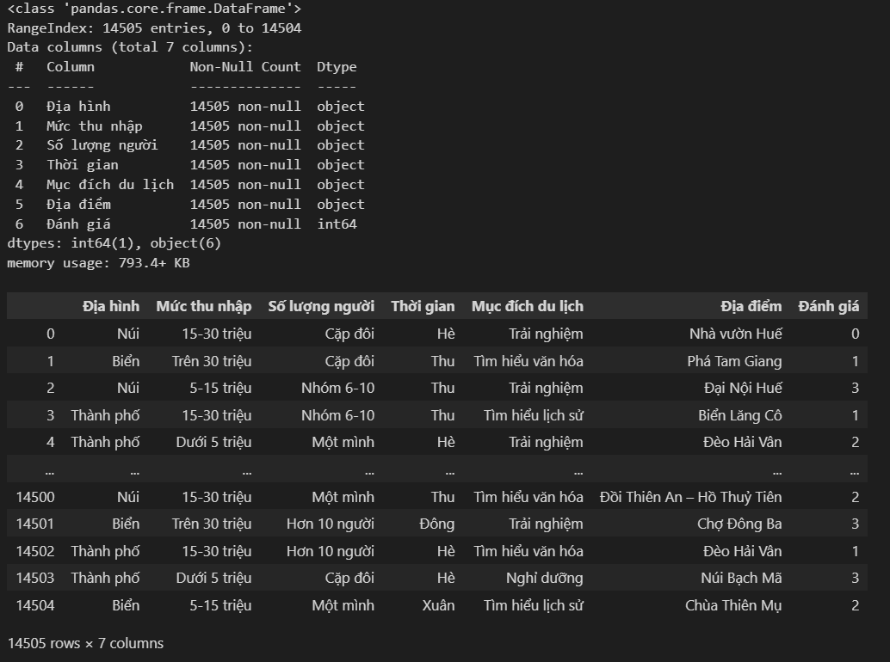
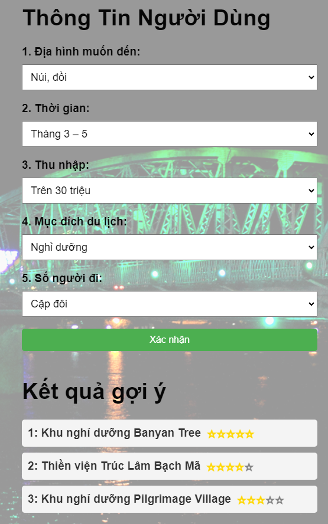

# Web app gợi ý địa điểm du lịch tại Huế

## Giới thiệu chung

Cốt lõi của chương trình là xây dựng mô hình Machine learning (ML) với 5 đặc trưng người dùng:

    - Mức thu nhập: ["Dưới 5 triệu", "5-15 triệu", "15-30 triệu", "Trên 30 triệu"]
    - Địa hình: ["Biển", "Núi", "Thành phố"]
    - Thời gian: ["Xuân", "Hè", "Thu", "Đông"]
    - Mục đích du lịch: ["Khám phá thiên nhiên", "Tìm hiểu lịch sử", "Tìm hiểu văn hóa", "Tâm dưỡng", "Trải nghiệm", "Nghỉ mát"]
    - Số lượng người: ['Một mình', 'Cặp đôi', 'Nhóm 3-5', 'Nhóm 6-10', 'Hơn 10 người']

Khi người dùng nhập 5 thông tin trên, mô hình sẽ đưa ra 3 địa điểm phù hợp nhất trong số danh sách gồm 20 địa điểm du lịch tại Huế:

    - Địa điểm =  ["Đồi Thiên An – Hồ Thuỷ Tiên", "Núi Bạch Mã", "Suối khoáng Thanh Tân", "Biển Lăng Cô", "Biển Thuận An", "Khu nghỉ dưỡng Banyan Tree", "Khu nghỉ dưỡng Pilgrimage Village", "Chùa Thiên Mụ", "Chùa Từ Đàm", "Bảo tàng Mỹ thuật Cung đình Huế", "Thiền viện Trúc Lâm Bạch Mã", "Nhà vườn Huế", "Lăng tẩm Huế", "Cầu Tràng Tiền", "Đại Nội Huế", "Sông Hương", "Phá Tam Giang", "Phố đi bộ Huế", "Chợ Đông Ba", "Đèo Hải Vân"]

## Cơ sở xây dựng mô hình

### Tập dữ liệu

Thu thập dữ liệu từ khảo sát người dùng lấy thông tin về 5 đặc trưng trên, địa điểm du lịch và đánh giá của người dùng về địa điểm du lịch đó (0 -> 5*)

### Lựa chọn mô hình học máy

Đầu vào: 5 đặc trưng người dùng và địa điểm du lịch
Đầu ra: đánh giá của người dùng về điểm du lịch đó ( từ 0* đến 5*)
Thử nghiệm với 4 mô hình SVM, Xgboost, Random Forest, Decision Tree với các bộ tham số khác nhau
=> Chọn mô hình SVM
Như vậy khi người dùng nhập vào thông tin của mình, sẽ kết hợp lần lượt với 20 điểm du lịch để hình thành đầu vào cho mô hình
Sau đó, mô hình đưa ra dự đoán về đánh giá người dùng về 20 địa điểm du lịch đó.
Chương trình sẽ lấy ra 3 địa điểm có đánh giá cao nhất để gợi ý cho người dùn

